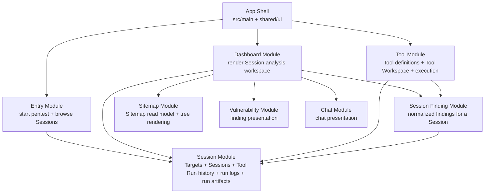

# NullTrace Module Map

This file is a working map of the current intended Modules in NullTrace.

The goal is not to mirror the database schema or the folder tree exactly.
The goal is to make ownership and seams easier to understand.

## Current Module Map

## Module Boundaries

### Session Module

Owns:

- Target identity and lookup
- Session identity and lifecycle
- Tool Run history inside a Session
- run logs
- raw run artifacts

Does not own:

- how a specific tool works
- how raw artifacts become normalized findings
- how the Dashboard presents Session state

Why:

- a Tool Run is a historical event inside a Session
- raw logs and raw artifacts are part of Session history

### Tool Module

Owns:

- Tool definitions
- Tool registry
- Tool Workspace behavior
- command preparation and execution workflow
- tool-specific artifact collection adapters such as `nmap`

Does not own:

- Session persistence rules
- Session Finding normalization or upsert rules
- long-term Tool Run history semantics

Why:

- Tool answers “how do we run this capability?”
- it does not answer “what does the Session now believe?”

### Session Finding Module

Owns:

- normalized Session-level findings
- severity normalization
- fingerprinting
- finding upsert rules
- mapping raw artifacts into finding candidates

Does not own:

- raw scanner truth
- command execution
- general Session creation or Target lookup

Why:

- `ToolRunArtifact` is raw run truth
- `SessionFinding` is normalized product truth for the whole Session

### Dashboard Module

Owns:

- the analysis workspace screen
- Dashboard read models for the current Session
- presentation-level composition of Sitemap, Vulnerability, Chat, and Tool entrypoints

Does not own:

- raw persistence queries as an implementation detail spread across panels
- Tool execution rules
- Session Finding normalization rules

Why:

- Dashboard should consume Session state through a seam
- it should not become the place where persistence and product rules mix

### Entry Module

Owns:

- target input flow
- opening existing Sessions
- browsing Session history

Does not own:

- Session persistence rules
- Tool execution
- finding interpretation

## Folder Guidance

`src/features/*` is currently a mix of true Modules and UI slices.

The intended direction is:

- `features/session` should behave like a real Module
- `features/tool` should behave like a real Module
- `features/dashboard` should become a clearer read-model Module over time
- `features/sitemap`, `features/vulnerability`, and `features/chat` are currently smaller support Modules or presentation slices used by Dashboard

This means the top-level feature folder should ideally answer one main question:

- `session`: what happened in this pentest Session?
- `tool`: how do Tools get configured and executed?
- `session-finding`: what does the Session know about the Target after interpretation?
- `dashboard`: how do we present Session state?

## Practical Rules

When deciding where code belongs, prefer these rules:

1. Put code with the Module that owns the invariant, not just the nearest related table.
2. Foreign keys show relationships; they do not define Module ownership.
3. If a Module’s interface is getting broader because it owns multiple kinds of truth, split the truth, not just the file.
4. Raw run truth and normalized product truth should stay separate.
5. A folder is only a useful Module marker if callers can understand what it owns without reading half the repo.

## Current Tension Points

These are the places most likely to need future refactoring:

- `session.repository.ts` is still broad and owns several kinds of persistence
- the Dashboard still uses mock-heavy read paths instead of a Session read seam
- the `Session Finding` Module exists, but its main rules are still only partially implemented
- some top-level `features/*` folders are still presentation slices more than deep Modules
